## Visual Servoing Project Report

## Contents

* Introduction 
    * Project Objective
    * Tools

* Tasks and Their Implementation 
    * Camera Calibration
    * Real Time Image Handling
    * Map Creation
    * Shortest Path Finding with A* Algorithm
    * Robot Navigation to the Way Points
    * Parking

* Demo Video
 


## Introduction

Path finding and navigation is a frequently encountered task in the field
of robotics. Although there are many different methods of transporting a
mobile robot from its starting position to a specific destination, in this
project, we tried to fulfill this task by using a hand to eye visual
servoing system.

### Project Objective

The goal of the project is to control a robot using a fish eye camera fixed on the top of the environment using hand to eye visual servo system. The main purpose is to navigate the robot via this camera to the given target point avoiding obstacles.

### Tools

The hardware and the software tools used for this project:  
<br>
• Turtlebot3 Burger  
• FE185C057HA-1 Fish eye Camera  
• Ubuntu 20.4  
• ROS Noetic


## Tasks and Their Implementation

We implemented this project full of different tasks and challenges, by dividing it into smaller steps. The flow chart below shows the general steps and operations of the project. <br>
Therefore, we regularly receive images from our fish-eye camera overlooks the environment, and use this information to calculate the initial position of the robot and the target, only once at the beginning. After transforming this positions into a maze map, we use the A* algorithm, we calculate the shortest path between the robot and target taking into account the obstacles. The way points we obtain as a result of the A* algorithm
become intermediate target points that the robot must reach one by one to reach the main target.
From this step on, we transform image frame (pixel-wise) positions to the camera frame positions and then calculate the appropriate speed to be sent to the robot.
After this transformation, the following cycle continues until the robot reaches the target point:
* Calculating the current position of the robot first in the camera coordinate system then in the
coordinate system of the way point to be reached. 
* Calculation of linear x and angular z speeds using
PID controller. 
* When the euclidian distance between the current position of the robot and the way point position is less than 0.05 m, the position of the next way point is loaded and the same process is applied until the last target point.

After reaching the final target point, parking as the last task is performed by orienting the robot with the same direction of
the target pose.

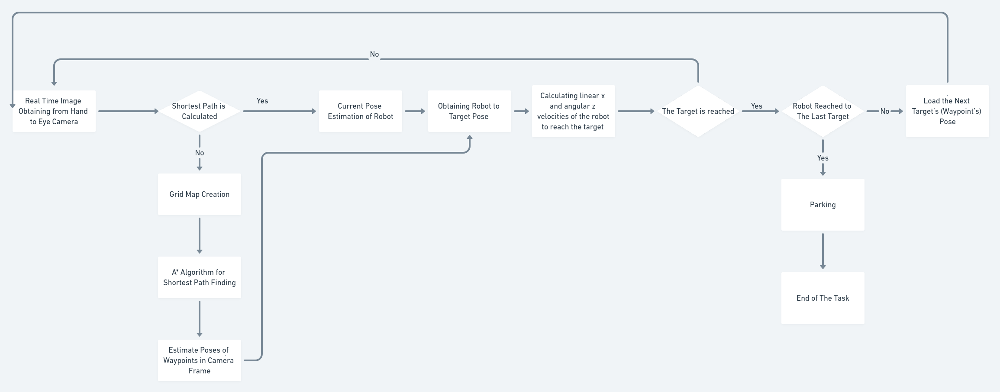

### Camera Calibration

To be able to use the images coming from the camera, we need to undistort them. For this purpose we calibrated the camera using a checkerboard and obtained the camera intrinsic, extrinsic parameters with distortion coefficients.

We used ROS camera_calibration package for this step with following command:  
<br>
rosrun camera_calibration cameracalibrator.py --size 8x6 --square 0.08
image:=/camera/image_raw camera:=/camera   
The package information is given in the following link:  
<br>
http://wiki.ros.org/camera_calibration/Tutorials/MonocularCalibration

Our intrinsic camera calibration parameters obtained and used during the project is as follows:

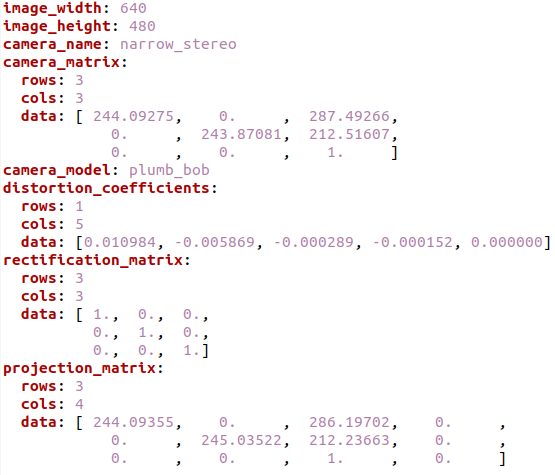

### Real Time Image Handling


Using the fish eye camera on the top of the environment, we obtain real time images coming from <b> camera/image_raw </b> topic using a subscriber listens to this topic. The first image is saved as <b> env.png </b> to be used for map creation step. Until the map is created, no other program starts to run and the images comes from the topic don't be used. 

After processing the first image to create the map, this program works during the whole process to maintain real time images and to calculate the current position of the robot. In this essence, the program detects in callback function of the subscriber, the 4 corner of the  <b> Aruco Markers having 15x15 cm size pasted on the top of the robot </b> which gives us the pixel wise - image frame position of the robot, then convert it to the camera frame 3D positions. These current positions will be used to navigate the robot step.

<b> real_time_image_subscriber.py </b> is the main source file for this step.

### Map Creation

Using  <b> env.png </b> image the following steps are performed to create the <b> binary map </b> of the environment

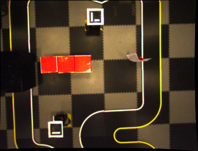

* Robot’s and target’s marker are detected. Since  <b> the robot’s marker has the  ID 0 and
target’s marker has the ID 1 </b>, we can easily distinguish which is the robot’s marker detection
and which is the target’s marker detection.

  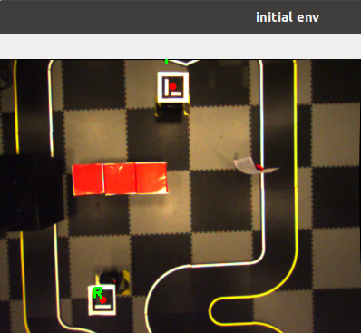

* We detect red boxes applying an RGB low – high value mask to our image. After
applying this mask, we obtain an image where only the obstacles, robot’s and target’s center
points are visible while other pixels are all black. At the same time we draw grid map on this grayscale image to see how our image will be compressed to have an appropriate maze to use with A* algorithm

  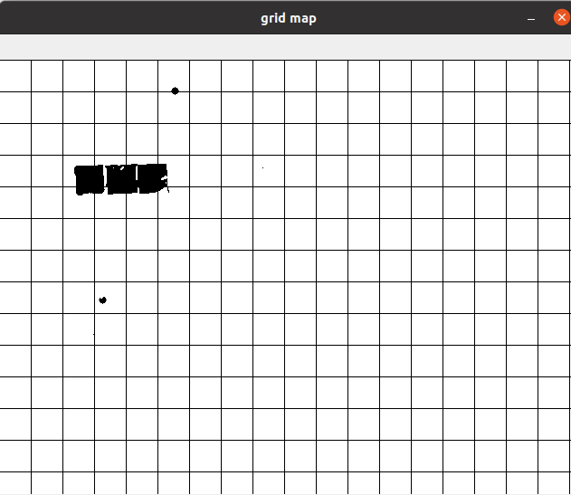

* This grid map has 40x40 boxes which is almost the obstacle size in pixels and its only to visualize the binary map in real image size before compress it to obtain the binary maze (a python list having 1 for obstacles, robot and target position and 0 for otherwise). In this essence, we simply travel through our image with a 40x40 window size, we put 1 if any obstacle pixel is found in this window
area and 0 otherwise. 

  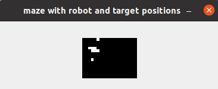  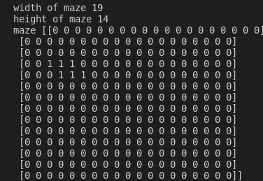


### Shortest Path Finding with A* Algorithm

The A* star algorithm implementation is taken from this link: https://medium.com/@nicholas.w.swift/easy-a-star-pathfinding-7e6689c7f7b2 and to use that, we need our python list maze, robot's and target position's in this maze. We obtain robot's and target's positions directly by dividing their real image positions to grid map box size:

``` python

if markerID == ROBOT_MARKER_ID:
cv2.putText(env,  "R", (topLeft[0], topLeft[1] - 15), cv2.FONT_HERSHEY_SIMPLEX, 0.5, (0, 255, 0), 2)
global robot_indexes
robot_indexes = (cX,cY)

elif markerID == TARGET_MARKER_ID:
cv2.putText(env, "T", (topLeft[0], topLeft[1] - 15), cv2.FONT_HERSHEY_SIMPLEX, 0.5, (0, 255, 0), 2) 
global target_indexes
target_indexes = (cX,cY)  

......
......

start = (int(robot_indexes[0]/step_size), int(robot_indexes[1]/step_size)) 
end = (int(target_indexes[0]/step_size), int(target_indexes[1]/step_size)) 

```

A* algorithm gives us the way points of the shortest path as a Python list again. 

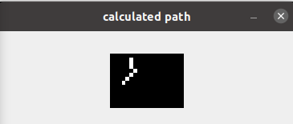 

We convert this maze point indexes to the real image size indexes by multiplying the way point coordinates by grid map box size (40x40 pixels). 

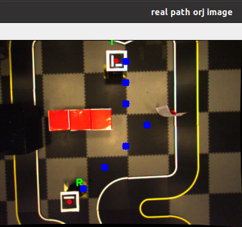

The last step is to <b> convert these image frame way points to the camera frame positions </b> For this part, we wanted to use the same method where we calculate the Robot Pose from robot's image frame (pixel wise) position so we treated the way points as marker points by copying the marker images to the initial image on waypoint coordinates.

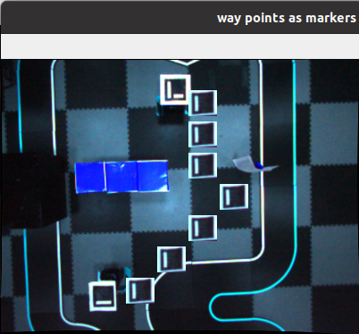 

 Then cv2.aruco.estimatePoseSingleMarkers() function is used as well as in Robot Pose estimation to obtain rotational and translational vector of the marker's pose. 

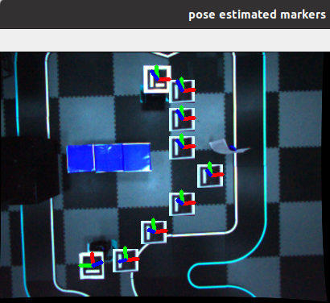


Having all the way points and their positions in the camera frame, we are ready to navigate the robot through these way points in the next step.

The main code map creating is <b> create_map.py </b> which calls astar function inside.

### Robot Navigation to the Way Points

After finding the path to follow, we take the current position of the robot coming from
real_time_image_subscriber.py and way point positions from create_map module. We calculate the the robot position in the first way point frame which gives us the difference in x and y axes as well as the rotation in z axes which are the all we need to calculate the linear x and angular z speed of the robot in order to move through the target direction.
This calculation is made  <b> by multiplication the inverse of the homogeneous robot position
matrix by the homogeneous target matrix </b>.

Homogenous Matrix of Robot or Way Point:

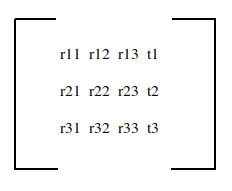


Robot to Target Homogenous Matrix:

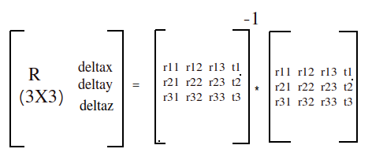

<br>

!!! Note that cv2.aruco.estimatePoseSingleMarkers() function returns <b> 3x1 rotational and translational vectors while for 3x4 homogenous matrix we need rotational matrix. </b> We convert our rotational vector to the rotational matrix using cv2.Rodrigues() function which is useful for both side of conversion. (rotational matrix to rotational vector or rotational vector to rotational matrix)

Using <b> arctan2(deltay / deltax) </b>, we calculate the orientation angle that the robot should take, we wait until the robot fixes its angle until the error goes lower than 5 degrees, then let
it go straight forward on x axis direction.  
<br>
During the orientation step, we calculate the angular z axis speed velocity of robot using <b> w = k_alpha * alfa </b> equation which gives us the  <b> velocity in radians </b>. Here, alfa is the result comes from <b> alfa = np.arctan2(deltay, deltax) </b> and <b> k_alpha </b> is a constant we determined as 1.2
During this step, linear x velocity is 0 since we are waiting the robot to fix its orientation
before start moving towards the target.Once the orientation angle is fixed, we calculate the linear x speed to move the robot forward. This velocity v is calculated using <b> v = k_p * p 
</b> where <b> p is the euclidian distance </b> between robot and target pose and k_p is a constant we determined as 0.8. To calculate the euclidian distance we use deltax and deltay with <b> p = math.sqrt(deltax**2 + deltay**2) </b>. The threshold to decide if the robot is reached the target is 0.045 meter.  
<br>
In general, if the robot fixes the orientation angle, linear x speed is set to 0 and if the
robot moves straight forward, the angular z speed is set to 0. We check the orientation
error after the initial orientation, while the robot goes forward, and if the error starts to
increase again, we stop the robot’s forward speed and let it fix the orientation again. For that
step, the threshold for the orientation error is 15 degrees.

This process is running in a loop for each real time image obtained by the subscriber until
the robot reaches every way point and the final target position at the end.

The main code for this task is implemented in <b> controller.py  </b> file.

!!! Since the Turtlebot3’s maximum angular velocity is 2.84 radians/sec and maximum linear
velocity is 0.22 m/sec, we determined the following constraints to be sure we don’t publish
any velocity information that may harm the robot.

``` python

if v > 0.22:
v = 0.22
elif v < -0.22:
v = -0.22
if w > 2.84:
w = 2.84
elif w < -2.84:
w = -2.84

```

### Parking

After reaching the final target position, the robot is parking according to the rotational direction of the target position. We convert the rotational matrix of final homogenous matrix (robot to target homogenous matrix) to the rotational vector using <b> cv2.Rodrigues </b> function again. This 3x1 rotational vector's last index contains the rotational error in z axes between robot and target orientation. Using this error, we stop the robot’s linear x speed and only adjust angular z speed until the error goes lower than 5 degrees. 

## Demo Video

Screen Record


https://user-images.githubusercontent.com/20625822/145051192-f63d0544-fa23-4be9-8870-74b20bc28ea7.mp4


Environment Record


https://user-images.githubusercontent.com/20625822/145051181-24c07870-103a-4767-ad6a-0c11f5c231d7.mp4


If you would like to test the code, please run the following commands in the same order:

1) roscore 
2) roslaunch turtlebot3_bringup turtlebot3_robot.launch (on robot side after connecting to the turtlebot3 with ssh connection)
3) roslaunch ueye_cam rgb8.launch (to open the camera) (on remote PC)
4) rosrun vs_project scripts/real_time_image_subscriber.py (on remote PC)
5) rosrun vs_project scripts/controller.py (on remote PC)

